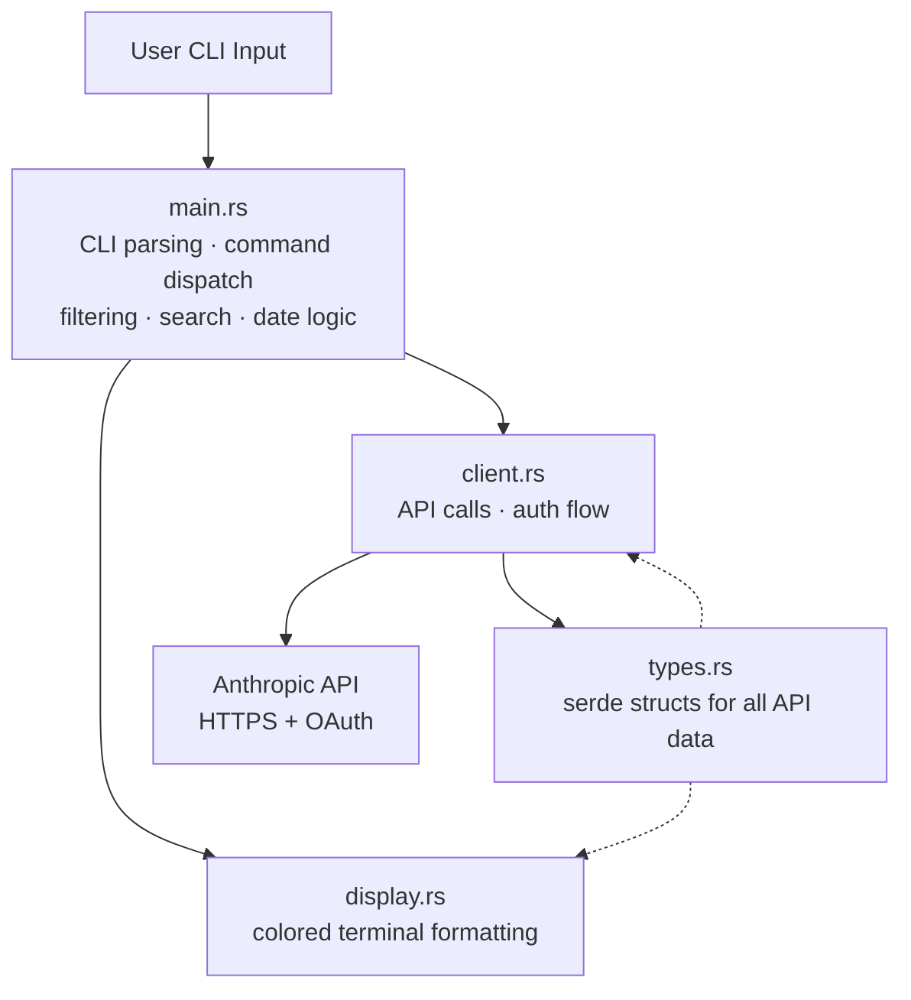
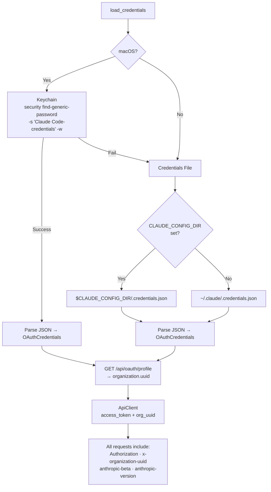
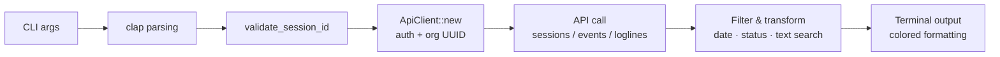
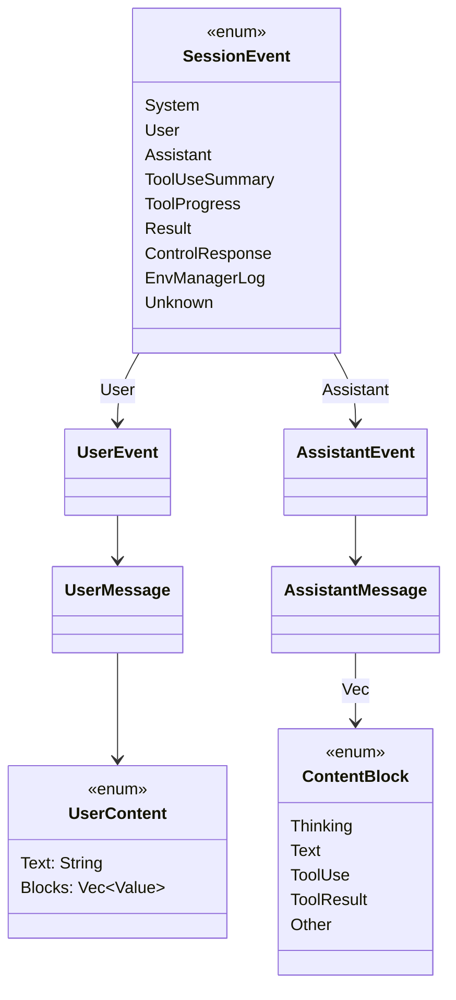

# Architecture

## Overview

claude-teleport-analyzer is a Rust CLI that reads Claude Code remote session data from the Anthropic API using OAuth credentials.



## Authentication (Cross-Platform)



| Platform | Primary | Fallback |
|----------|---------|----------|
| macOS | Keychain via `security` CLI | `~/.claude/.credentials.json` |
| Linux | `~/.claude/.credentials.json` | -- |
| Windows | `%USERPROFILE%\.claude\.credentials.json` | -- |

## Command Data Flow



Six subcommands: `list`, `show`, `read`, `summary`, `loglines`, `export`.

## API Endpoints

| Method | Endpoint | Pagination | Notes |
|--------|----------|------------|-------|
| `list_sessions()` | `GET /v1/sessions` | No | Returns all sessions |
| `get_session(id)` | `GET /v1/sessions/{id}` | No | Single session metadata |
| `get_events(id, max)` | `GET /v1/sessions/{id}/events` | Yes (cursor-based) | 1000 events/page, `?after_id=<last_id>` |
| `get_loglines(id)` | `GET /v1/session_ingress/session/{id}` | No | Compact transcript |

## Event Pagination

```mermaid
flowchart TD
    Start[get_events] --> Fetch[GET /v1/sessions/{id}/events<br/>?after_id=cursor]
    Fetch --> Append[Append page to Vec]
    Append --> CheckMax{max_events<br/>reached?}
    CheckMax -->|Yes| Truncate[Truncate & return]
    CheckMax -->|No| CheckMore{has_more?}
    CheckMore -->|Yes| UpdateCursor[cursor = last_id] --> Fetch
    CheckMore -->|No| Return[Return all events]
```

Sessions can have 10,000+ events (1000 per page).

## Event Type Hierarchy



`SessionEvent` uses `#[serde(tag = "type")]` for internally-tagged deserialization. `Unknown` with `#[serde(other)]` catches any future event types. `UserContent` uses `#[serde(untagged)]` since content can be a plain string or block array with no discriminator.

## Key Design Decisions

1. **Strongly-typed events over `serde_json::Value`** -- catches deserialization mismatches at compile/test time.
2. **`#[serde(other)]` for forward compatibility** -- new event types deserialize as `Unknown` instead of crashing.
3. **Cursor-based auto-pagination** -- the client transparently fetches all pages with a progress indicator on stderr.
4. **Cross-platform auth with macOS Keychain priority** -- Keychain first on macOS, file-based fallback everywhere.
5. **Client-side filtering** -- the API doesn't offer server-side filtering, so we fetch then filter locally.
